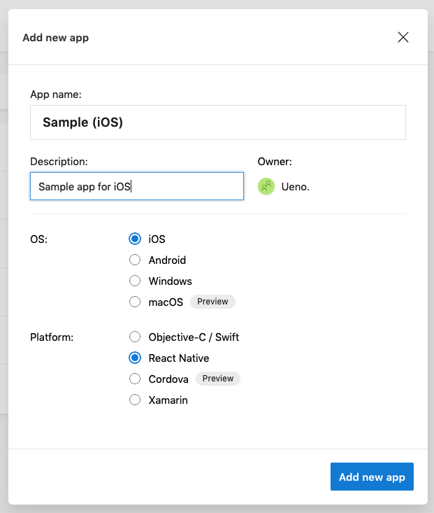
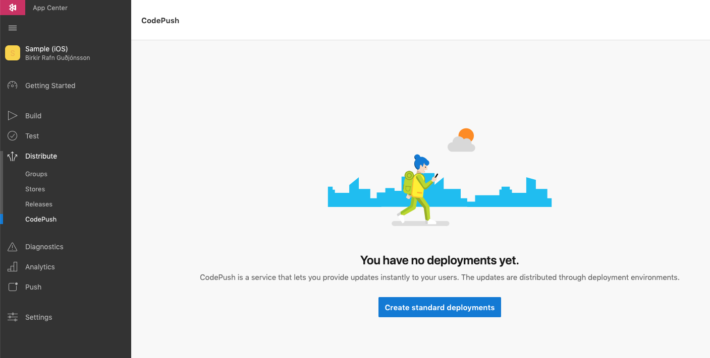
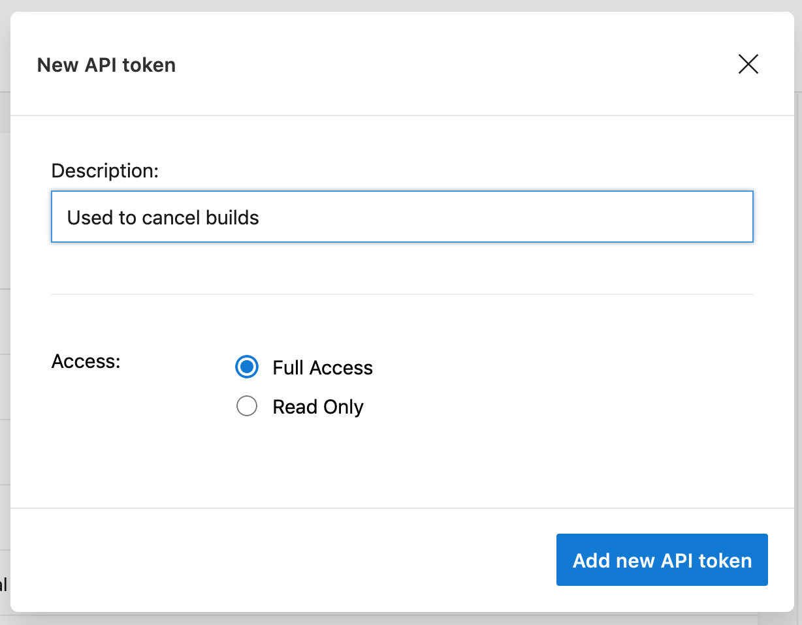
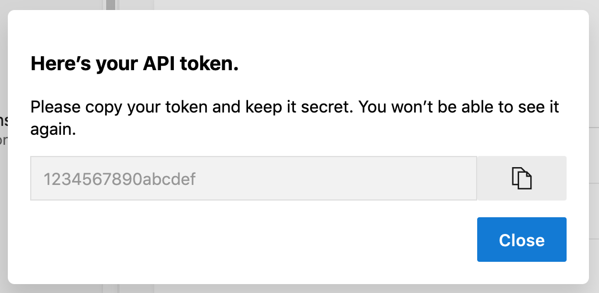
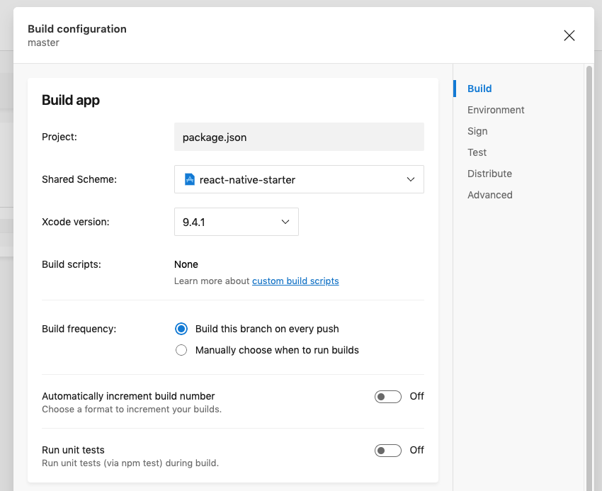
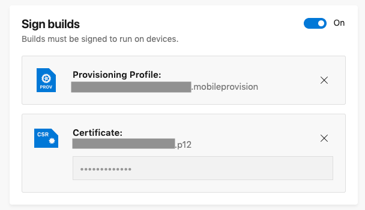
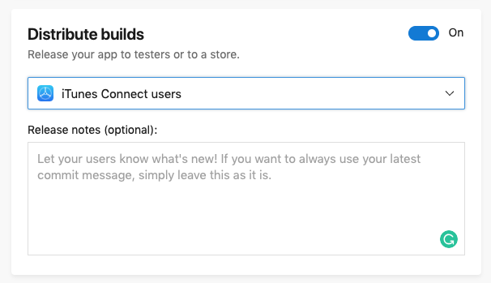

# App Center

This guide will help you set up CI pipeline for App Center.

Pre-requirements: Sentry and 

1. Add New App, for example `"Sample (iOS)"`, select `iOS` for OS and `React Native` for Platform.



2. Create an CodePush deployment configuration

Go to **Distribute** -> **CodePush** and hit the `"Create standard deployments"` button.



You can see your keys by typing this into your console:

```bash
$ code-push deployment ls MyOrg/Sample-iOS -k
┌────────────┬──────────────────┬─────────────────────┬──────────────────────┐
│ Name       │ Deployment Key   │ Update Metadata     │ Install Metrics      │
├────────────┼──────────────────┼─────────────────────┼──────────────────────┤
│ Production │ 1234567890abcdef │ No updates released │ No installs recorded │
├────────────┼──────────────────┼─────────────────────┼──────────────────────┤
│ Staging    │ 1234567890abcdef │ No updates released │ No installs recorded │
└────────────┴──────────────────┴─────────────────────┴──────────────────────┘
```

3. Get an App Center API Token

Go to **Your Name** in the lower left corner of the screen and hit **Account Settings**. Then click **API Tokens** in the left menu and there should be a button called `New API token`.



Make sure to store this token safely. You will be using it twice, once for each platform. It will disappear once you close this dialog:



4. Go to **Build** in the sidebar, select your branch for example **master** and click the gear icon in the top right corner (you can also hover over the branch row and go to configure from there).

5. Change the **Shared Scheme** to `react-native-starter` or the name of your scheme, do not select *build-env*. Make sure you turn off **Automatically increment build number**. It is recommended to run the tests before each build, but I left it as optional.



6. Insert all your environment variables. 

```bash
# iOS specific variables
IOS_BUNDLE_ID=
IOS_CODEPUSH_DEPLOYMENT_KEY=
IOS_CODEPUSH_DEPLOYMENT_KEY_STAGING=
IOS_CODEPUSH_APPID=

# This can be shared between iOS and Android
SENTRY_DSN=
SENTRY_PROJECT=
SENTRY_ORG=

# Secret variables (also shared)
APPCENTER_API_KEY=
CODEPUSH_ACCESS_KEY=
SENTRY_AUTH_TOKEN=
```


7. Upload required files for code signing the app.

See https://docs.microsoft.com/en-us/appcenter/build/ios/uploading-signing-files how to get these files.



8. Configure your distribution

There are basicly two options available

**Distribute to AppCenter groups**

This requires less waiting time, but more work is involved for the testers.

**Distribute to a Store**

This is the recommended method, distribute straight to iTunes Connect users is the fastest way to test your app. You can also choose your own TestFlight group or distribute to the production Store if you will.


